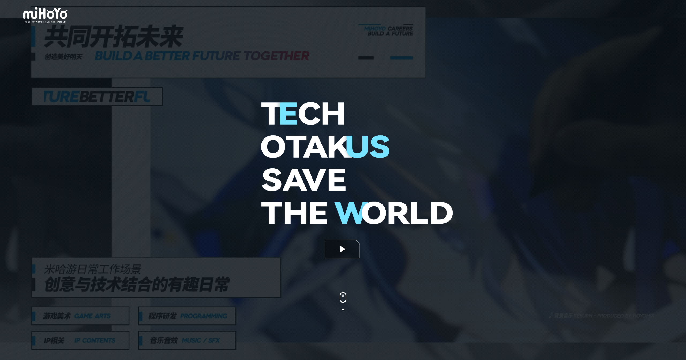
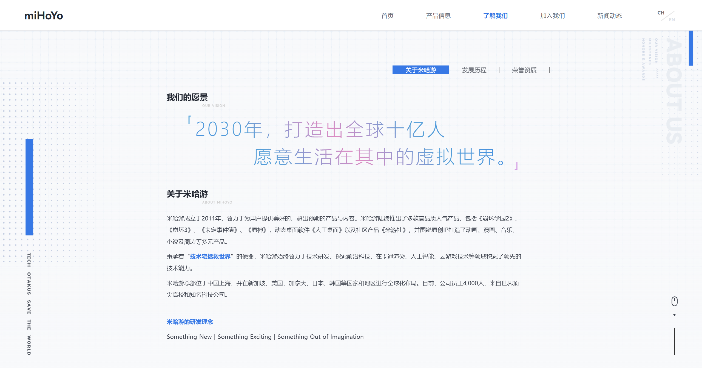
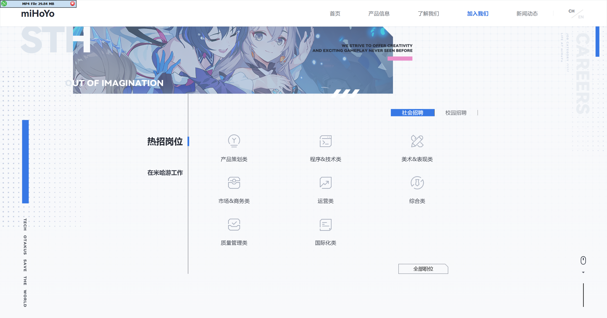

一个基于 **Nuxt 3 + Vue 3 + TypeScript** 仿 miHoYo 官网视觉仿站项目。项目包括原页面的主要视觉结构、全屏滚动、产品轮播、新闻展示、关于我们、加入我们等页面内容，并使用现代前端工程化方案重新整理代码结构。

> 声明：本项目仅用于前端学习、技术研究和非商业展示。页面中的品牌、文案、图片、视频、字体及相关素材版权归原权利方所有。

## 项目预览



| 产品页面 | 关于页面 |
| --- | --- |
|  |  |

| 加入我们 | 新闻动态 |
| --- | --- |
|  |  |

## 项目亮点

- 使用 Nuxt 3 稳定版，工程结构更清晰。
- 全量 TypeScript 化，核心组件使用 `<script setup lang="ts">`。
- 保留原站全屏滚动、轮播切换、视频遮罩、页面动效等交互体验。
- 使用本地 JSON 管理导航、Banner、产品、新闻、招聘和页脚数据。
- 支持 SSR 构建、静态站点生成以及常见平台部署。

## 技术栈

| 分类 | 技术 |
| --- | --- |
| 应用框架 | Nuxt 3.13 |
| UI 框架 | Vue 3 Composition API |
| 开发语言 | TypeScript |
| 状态管理 | Pinia / Nuxt `useState` |
| 样式方案 | Less、Scoped CSS、全局 CSS |
| 轮播交互 | Swiper 5 |
| 代码规范 | ESLint、@nuxt/eslint |
| 数据来源 | `public/data/*.json` 本地静态数据 |
| 构建工具 | Nuxt / Nitro |

## 目录结构

```text
.
├── assets/
│   ├── css/                  # 全局样式与动画
│   └── js/api.ts             # 本地 JSON 数据读取方法
├── components/
│   ├── Page/                 # 首页、产品、关于、加入我们、新闻页面
│   ├── MiHeader.vue          # 顶部导航
│   ├── MiFooter.vue          # 页脚
│   ├── MiMaskVideo.vue       # 视频弹层
│   └── NavBar.vue            # 产品页导航
├── composables/
│   └── useFaded.ts           # 淡入淡出逻辑
├── image/                    # README 截图
├── layouts/
│   └── miLayout.vue          # 全屏 Swiper 布局
├── pages/
│   └── index.vue             # 站点入口
├── public/
│   ├── data/                 # 页面 JSON 数据
│   ├── fonts/                # 字体资源
│   └── img/                  # 页面本地图片
├── nuxt.config.ts
├── package.json
└── tsconfig.json
```

## 环境要求

推荐使用以下环境：

- Node.js 18.18+ 或 Node.js 20 LTS
- npm 9+，也可以使用 pnpm / yarn
- Git

查看本机版本：

```bash
node -v
npm -v
git --version
```

## 本地运行

1. 克隆项目：

```bash
git clone https://github.com/你的用户名/你的仓库名.git
cd 你的仓库名
```

2. 安装依赖：

```bash
npm install
```

Windows PowerShell 如果拦截 `npm.ps1`，请使用：

```powershell
npm.cmd install
```

3. 启动开发服务器：

```bash
npm run dev
```

4. 浏览器访问：

```text
http://localhost:3000
```

## 常用命令

| 命令 | 说明 |
| --- | --- |
| `npm run dev` | 启动本地开发环境 |
| `npm run build` | 构建 SSR 生产产物 |
| `npm run preview` | 预览生产构建 |
| `npm run generate` | 生成静态站点 |
| `npm run lint` | 运行 ESLint 检查 |
| `npm run typecheck` | 运行 Nuxt 类型检查 |

## 生产构建

生成 SSR 生产构建：

```bash
npm run build
```

构建完成后会生成 `.output/` 目录，启动生产服务：

```bash
node .output/server/index.mjs
```

默认访问：

```text
http://127.0.0.1:3000
```

指定端口示例：

```bash
PORT=8080 node .output/server/index.mjs
```

Windows PowerShell：

```powershell
$env:PORT="8080"
node .output/server/index.mjs
```

## 静态站点生成

如果要部署到 GitHub Pages、Netlify 静态站点、Nginx 静态目录等平台，可以生成静态文件：

```bash
npm run generate
```

生成结果位于：

```text
.output/public
```

部署时只需要上传 `.output/public` 目录中的文件。

## 部署到 Vercel

Vercel 对 Nuxt 支持较好，适合一键部署。

1. 将项目上传到 GitHub。
2. 打开 [Vercel](https://vercel.com/) 并登录。
3. 点击 `Add New Project`，选择当前 GitHub 仓库。
4. Framework Preset 选择 `Nuxt.js`。
5. 保持默认配置：

```text
Install Command: npm install
Build Command: npm run build
Output Directory: .output
```

6. 点击 `Deploy`，等待构建完成。
7. 部署完成后，Vercel 会生成一个线上访问地址。

## 部署到 Netlify

Netlify 可以部署静态站点，也可以配合 Nuxt 适配器部署。

推荐静态部署：

1. 将项目上传到 GitHub。
2. 打开 [Netlify](https://www.netlify.com/) 并登录。
3. 点击 `Add new site` -> `Import an existing project`。
4. 选择 GitHub 仓库。
5. 构建配置填写：

```text
Build command: npm run generate
Publish directory: .output/public
```

6. 点击 `Deploy site`。

## 部署到 GitHub Pages

GitHub Pages 推荐使用静态生成方式。

1. 确保项目已上传到 GitHub。
2. 本地生成静态文件：

```bash
npm run generate
```

3. 如果仓库名不是 `用户名.github.io`，需要设置 Nuxt 的基础路径。假设仓库名是 `mihoyo-site`，构建前执行：

```bash
NUXT_APP_BASE_URL=/mihoyo-site/ npm run generate
```

Windows PowerShell：

```powershell
$env:NUXT_APP_BASE_URL="/mihoyo-site/"
npm run generate
```

4. 将 `.output/public` 发布到 GitHub Pages。可以使用 `gh-pages`：

```bash
npm install -D gh-pages
npx gh-pages -d .output/public
```

5. 打开 GitHub 仓库的 `Settings` -> `Pages`。
6. Source 选择 `Deploy from a branch`。
7. Branch 选择 `gh-pages`，目录选择 `/root`。
8. 保存后等待 GitHub Pages 构建完成。

访问地址通常为：

```text
https://你的用户名.github.io/仓库名/
```

## 部署到服务器 Nginx

### 方式一：SSR 部署

适合需要 Nuxt 服务端渲染的场景。

1. 在服务器安装 Node.js 18+。
2. 上传项目代码并安装依赖：

```bash
npm install
npm run build
```

3. 使用 PM2 守护进程：

```bash
npm install -g pm2
pm2 start .output/server/index.mjs --name mihoyo-site
pm2 save
```

4. 配置 Nginx 反向代理：

```nginx
server {
  listen 80;
  server_name example.com;

  location / {
    proxy_pass http://127.0.0.1:3000;
    proxy_http_version 1.1;
    proxy_set_header Host $host;
    proxy_set_header X-Real-IP $remote_addr;
    proxy_set_header X-Forwarded-For $proxy_add_x_forwarded_for;
    proxy_set_header X-Forwarded-Proto $scheme;
  }
}
```

### 方式二：静态部署

适合纯静态托管。

1. 本地或服务器执行：

```bash
npm run generate
```

2. 将 `.output/public` 上传到服务器目录，例如：

```text
/var/www/mihoyo-site
```

3. 配置 Nginx：

```nginx
server {
  listen 80;
  server_name example.com;
  root /var/www/mihoyo-site;
  index index.html;

  location / {
    try_files $uri $uri/ /index.html;
  }
}
```

4. 重载 Nginx：

```bash
nginx -t
sudo systemctl reload nginx
```

